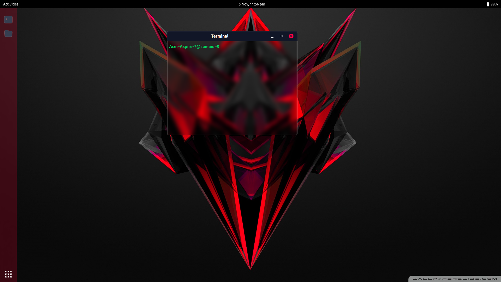

# 😎 Awesome Web Desktop Environment - Ubuntu GNOME Inspired

Welcome to the **Awesome Web Desktop Environment** project! 🚀 This is all about bringing the joy of the Ubuntu GNOME desktop environment into your web browser, purely for the fun of it! 😄

## Tech Stack

Here's the exciting tech stack that makes this project possible:

- **React**: For building a dynamic and responsive user interface.
- **Vite**: For super-fast development and bundling.
- **TypeScript**: To bring type safety to our codebase.
- **Tailwind CSS**: For styling and creating a beautiful, modern UI.

## Fun-Tastic Features

### 🖥️ Web-based Terminal - Tapping into the Nostalgia

- We bring you a web-based terminal, just like the good old days! No command line, no glory! 💬
- This terminal can be resized and dragged around like your pet dog... well, almost. 📏🐕
- Don't worry; we've made it so user-friendly that even the bugs are hardcoded. 🐞💻

### 🌟 Custom Features - Because You're Special

- Feeling like you're too cool for the usual suspects? Create your very own digital wonderland! 🪄
- Craft custom commands, build a digital funhouse with a file explorer, become a math wizard with a calculator, orchestrate your life with a digital calendar, put your style on the desktop with personalized wallpapers, and check your device's mood with the battery percentage. It's your world to mold! 🔋

## Ready to Dive In? Splash!

1. Clone this repository - it's like adopting a code puppy. 🐶

```bash
git clone <>
```

2. Navigate to the project directory - welcome to your digital manor.

```bash
cd directory
```

3. Install the required dependencies - like bringing in the digital furniture.

```bash
npm install
```

4. Start the development server - rev up your digital engine.

```bash
npm run dev
```

5. Open your web browser and access the application at http://localhost:3000. It's your new digital kingdom! 🏰

## Screenshots



## Contributing - Join the Digital Funhouse!

We thrive on the spirit of collaboration and creativity! Your contributions can make this digital funhouse even more exciting. Whether you're a coding wizard, a design virtuoso, or just an idea machine, there's a place for you in our circus.

### How You Can Contribute

- **Code Contributions**: Dive into the codebase and submit pull requests to enhance features, fix bugs, or implement new and exciting additions.
- **Design Enthusiasts**: If you have a knack for design, help us make our digital world visually stunning by contributing UI/UX enhancements.
- **Idea Magicians**: Have a cool idea or a feature suggestion? Create issues and share your thoughts to spark discussions and innovations.
- **Documentation Wizards**: Help us keep our documentation crystal clear and user-friendly.
- **Spread the Word**: Even a simple shout-out on social media can do wonders in bringing more people to the digital circus.

For more detailed guidelines on how to contribute, please refer to our [CONTRIBUTING.md](CONTRIBUTING.md) file.

We're open to all ideas and levels of expertise, from beginners to experts. Join us and be a part of the journey in making this project even more awesome!

Feel free to reach out, collaborate, and keep the party rolling in our digital funhouse! 🎪🎉

## Legally Cool

This project follows the [MIT License](LICENSE). Check out the LICENSE file if you're into that kind of stuff. 🤓

---

_Note: I didn't craft this README alone; I had a trusty sidekick, ChatGPT. Thanks to us for bringing this README to life! 🤖👨‍💻_
